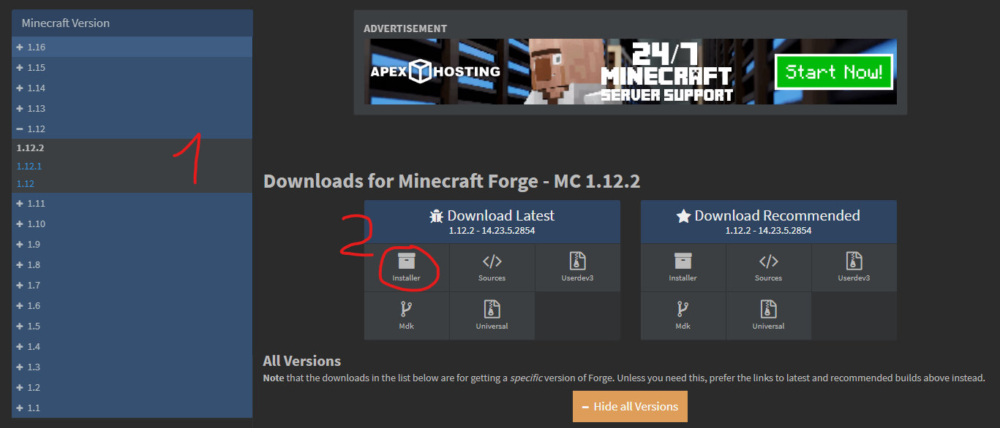

# Créer un serveur Forge

---

*   [Télécharger Forge](#download-forge)
*   [Créer le serveur Forge](#create-forge-server)
*   [Importer le serveur dans MCSS](#import-server)

## Télécharger Forge

Commencez par aller sur [le site de Forge](https://files.minecraftforge.net) et choisissez la version que vous voulez télécharger. Cliquez sur "Installer" pour télécharger l'installateur forge.

Attendez la fin de la pub (6 secondes) et cliquez sur "Skip" en haut à droite. Un fichier .jar va être téléchargé.

## Créer le serveur Forge

Une fois le téléchargement terminé, ouvrez le fichier `forge-<version_minecraft>-<version_forge>-installer.jar` pour commencer l'installation de Forge.
Choisissez "install server" et selectionnez un dossier vide dans lequel le serveur va être temporairement installé (il sera ensuite déplacé dans le dossier de MCSS) et cliquez sur OK. Les fichier nécessaires au serveur vont être téléchargés et placés dans le dossier indiqué.

Le dossier contient maintenant : 
*   Un dossier `libraries`
*   Un fichier `<version_minecraft>.json`
*   Un fichier `forge-<version_minecraft>-<version_forge>.jar`
*   Un fichier `minecraft-server.<version_minecraft>.jar`

Vous pouvez maintenant supprimer l'installateur de forge.

## Importer le serveur dans MCSS

Maintenant, ouvrez MCSS et allez dans "File > migrate server". Une nouvelle fenêtre s'ouvre. Dans celle-ci, choisissez un nom pour votre serveur ansi qu'un nom de dossier (qui sera stocké dans `mcss/servers/<nom_dossier>`). Choisissez la quantité de RAM allouée au serveur, en Mo (pour un serveur Forge, il est recommandé d'avoir au moins 4Go, ou 4096Mo). 
Dans "server type" choisissez Forge. Enfin, selectionnez le jar executable du serveur : c'est le fichier `forge-<version_minecraft>-<version_forge>.jar` du serveur que vous avez installé plus tôt et cliquez sur "Migrate". 
Tous les fichiers du serveur vont être copiés dans le dossier /servers de MCSS et votre serveur va apparaître dans la liste des serveurs. 

Vous pouvez maintenant démarrer le serveur Forge en cliquant sur "start". 
La première fois que le serveur va démarrer, la console affichera une erreur vous demandant d'accepter l'EULA. Pour cela, cliquez sur "server > show in file explorer" et ouvrez le fichier "eula.txt". Changez la ligne `eula=false` en `eula=true` puis démarrez à nouveau votre serveur. 
Cette fois, il va démarrer complètement et vous pourrez vous connecter depuis votre client Minecraft.

