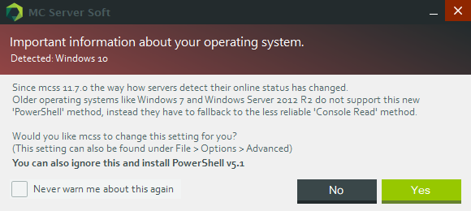
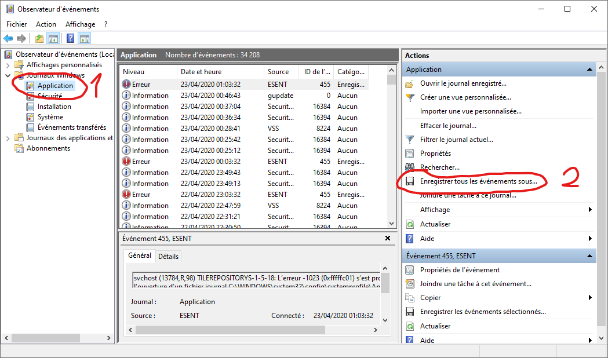
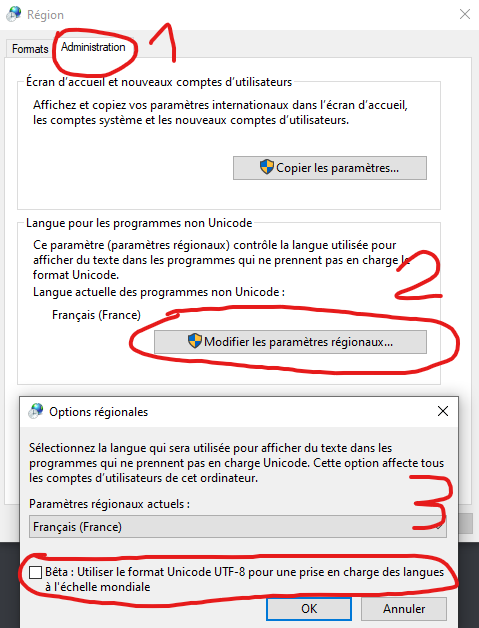

# FAQ

---

*   ["Error occurred during initialization of VM Could not reserve enough space for 2097152KB object heap."](#error-occurred-during-initialization-of-vm)
*   ["Unable to connect to the server."](#unable-to-connect-to-the-server)
*   [Y a-t-il une version pour Mac ou Linux ?](#is-there-a-mac-version)
*   [Est-ce 24h/24 7j/7 ?](#is-this-24-7)
*   [MCSS plante quand je le lance.](#mcss-crashes-when-starting-it)
*   ["Since v11.5.0 the process name requires a different format."](#process-name-different-format)
*   ["Important information about your operating system."](#important-information-os)
*   ["Failed to set performance counters."](#failed-to-set-performance-counters)
*   [J'ai cette IP un peu étrange : 2001:0db8:85a3:0000:0000:8a2e:0370:7334, est-ce normal ?](#weird-ip-address)
*   [Mettre à jour depuis la version 10.4.0.0 ou antérieure ne fonctionne pas.](#updating-from-10400-fails)
*   [Add (or update) the Java system path.](#add-update-java-path)
*   [MCSS a planté et je voudrais aider à résoudre le bug](#crashed-help-dev)
*   [L'encodage UTF-8 ne fonctionne pas, et j'en ai *vraiment vraiment* besoin.](#utf-8)

## "Error occurred during initialization of VM Could not reserve enough space for 2097152KB object heap."

Il vous manque probablement la version 64bits de Java. Soit elle n'est pas installée, soit elle a besoin d'une réinstallation.
Pour vérifier si elle est déjà installé, ouvrer l'invité de commandes et entrez :
`java -d64 -version`

Si vous obtenez une erreur, elle n'est pas installée. Vous pouvez télécharger Java 64bits [ici](https://java.com/fr/download/windows-64bit.jsp).

## "Unable to connect to the server."

Sur le même PC que celui qui héberge le serveur, connectez vous avec "localhost" (sans les ") 
Ça fonctionne ? super ! Ça veutdire que le serveur en lui-même fonctionne parfaitement !

Cependant, si vous voulez que d'autres personnes puissent rejoindre votre serveur, vous devrez rediriger un port de votre router.
[Voir la section sur la redirection de port](https://mcserversoft.github.io/documentation/port-forwarding).
 

## Y a-t-il une version pour Mac ou Linux ?

Non, malheureusement il n'y a pas de version pour Mac ou Linux. Mcss ne fonctionne que sous windows. 
**OS supportés**: Windows Server (2008R2 SP1/2012/2016), Windows 7, 8 et 10
 

## Est-ce 24h/24 7j/7 ?

Seulement si votre PC est allumé en permanence, c'est un logiciel qui tourne dessus. Si le PC est éteint, le serveur aussi. 
Rien à voir avec Aternos par exemple.
 

## MCSS plante quand je le lance.

Avez vous le [Framework .NET 4.7.2](https://dotnet.microsoft.com/download/dotnet-framework/net472) (ou plus haut) installé ?
 

## "Since v11.5.0 the process name requires a different format."

Ce changement est requis, cliquez sur 'Oui' pour appliquer le changement.

## "Important information about your operating system."

Lisez le texte de la boite de dialogue :  
 `Depuis MCSS 11.7.0, la manière dont le statut des serveurs est détecté a changée.`
 `Windows 7 ne supporte pas cette nouvelle méthode via 'PowerShell', à la place MCSS doit utiliser l'ancienne méthode, moins fiable, de détection avec la console.`
 `Les utilisateurs de Windows Server 2012 R2 peuvent ignorer cet avertissement et mettre à jour leur version de PowerShell vers la 5.1.`
 `Voulez vous changer la méthode de détection pour utiliser 'ConsoleRead' ?`
 `(Ce réglage peut aussi être retrouvé dans Files > Options > Advanced)`

> Il a été reporté par les autres utilisateurs que PowerShell peut être mis à jour sous Windows Server 2012, mais pas sous Windows 7. Leur meilleure option est de passer à la méthode "ConsoleRead". 

## "Failed to set performance counters."

Vos compteurs de performances sont corrompus. MCSS peut eutomatiquement réparer cela pour vous. Cliquez sour "Oui" pour les réstaurer.

Si vous souhaitez le faire manuellement :

Ouvrer l'invité de commande avec des permissions administrateur et exécutez les deux commades suivantes :
 `cd c:\windows\system32`
 `lodctr /R`
 (Si la commande lodctr échoue, exécutez la simplement une deuxième fois)

> Plus d'informations : [Microsoft Support | Comment recréer manuellement le conpteur de performances](https://support.microsoft.com/fr-fr/help/300956/how-to-manually-rebuild-performance-counter-library-values)
 

## J'ai cette IP un peu étrange : 2001:0db8:85a3:0000:0000:8a2e:0370:7334, est-ce normal ?

Oui cette adresse est complètement normale, c'est une adresse IPv6. La plupart des gens n'ont pas encore acès à l'IPv6, donc il est sûrement plus intelligent de partager votre IPv4 avec vos amis.

Il y a deux versions de l'IP :
 IPv4: 192.0.2.235
 IPv6: 2001:0db8:85a3:0000:0000:8a2e:0370:7334
 [Plus d'infos sur les IPv6](https://www.commentcamarche.net/contents/524-le-protocole-ipv6)
 
> FUN FACT: L'IPv6 n'a pas besoin de redirection de port, chaque ordinateur possède sa propre IP publique.

## Mettre à jour depuis la version 10.4.0.0 ou antérieure ne fonctionne pas.

À couse de changements dans l'API, les versions 10.4.0.0 (et antérieures) ont été considérées en fin de vie le 1er Janvier 2020.
Mettre à jour depuis ces versions anciennes n'est plus possible.

Vous devrez mettre à jour MCSS manuelement. Téléchargez la dernière version depuis le site et renommez le fichier "mcss.exe". Copiez et remplacez l'ancien fichier avec celui que vous venez de télécharger. (Faites une sauvegarde juste au cas ou)

## "Add (or update) the Java system path."

> La variable PATH est la variable système que votre système d'exploitation utilise pour localiser les executable nécessaires depuis la fenêtre du terminal.

1. Ouvrez une fenêtre de l'explorateur de fichiers. Faites un clic droit sur "Ce PC" et choisissez "Propriétés".
2.  Sur la gauche, cliquez sur Paramètres système avancés.
3. Cliquez sur Variables d'environnement. Dans la section Variables système, trouvez la variable 'environnement PATH et selectionnez la. Cliquez sur Modifier. Si la variable PATH n'existe pas, cliquez sur Nouvelle.
4. Dans la fenêtre "Modifier la variable d'environnement", spécifiez la valeur de la variable PATH. Cliquez sur OK. Fermez toutes les fenêtres restantes en cliquant sur OK.
5. Si vous utilisiez une fenêtre de l'invité de commandes, vous devrez la relancer.
 *(Instructions adaptés de <https://www.java.com/fr/download/help/path.xml>)*

## MCSS a planté et je voudrais aider à résoudre le bug

Pour aider à résoudre le bug, vous pouvez envoyer vos logs MCSS et vos logs d'évènements Windows.
*(Veuillez faire un zip avec tous les fichiers et me l'envoyer pas e-mail, Spigot ou Discord)*

Pour obtenir les logs de MCSS :
> Vous pouvez les trouver dans le dossier d'installation du logiciel dans /logs 

Pour obtenir les logs d'évènements windows :
> dans le menu démarrer, entrez eventvwr puis entrée.
Suivez ensuite les étapes de la capture d'écran ci-dessous.

## L'encodage UTF-8 ne fonctionne pas, et j'en ai *vraiment vraiment* besoin.

La triste réalité est que l'encodage UTF-8 est très marginal sous Windows.

Avec windows 10 1903, Vous avez la possibilité de changer les paramètres régionnaux du système (language pour les programmes non-Unicodes) pour l'UTF-8, mais cette fonctionnalité est en beta.

Pour chager ce réglage :
*   Lancez `intl.cpl` avec Windows + R (Qui ouvre les réglages régionnaux du panneau de configuration)
*   Suivez les instructions de la capture d'écran ci-dessous.

Dans certains cas, le serveur devra être redémarré avec un argument additionnel. Par exemple `-Dfile.encoding=UTF-8`, mais ceci varie en fonction du type de serveur concerné. Des recherches plus approfondies seront nécessaires de votre côté.

Même après tout cela, il n'est pas garanti que tous les problèmes soient réglés. Ça montre juste à quel point le support pour l'encodage UTF-8 est mauvais dans la console Windows...

(sources)
*   <https://stackoverflow.com/a/57134096>,
*   <https://books.google.be/books?id=tkFPDwAAQBAJ&pg=PA436&lpg=PA436&dq=UTF-8+is+a+second-class+citizen+in+Windows&source=bl&ots=E9LdoNrGie&sig=ACfU3U0CaOrY_k5aj-tZ8xri76hgEAZ5Vw&hl=en&sa=X&ved=2ahUKEwja_vj00-DoAhVFDuwKHdBjAiwQ6AEwAHoECAsQKQ>
