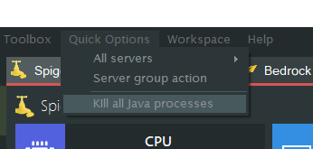

# FAQ

## **My 1.17 server won't start !**

The latest release of Minecraft requires Java 16 to even start. You can download it [here](https://www.oracle.com/java/technologies/javase-jdk16-downloads.html). 

Please note that 1.16 and below **cannot** run using Java 16. To run both 1.17 and 1.16 (or below) servers on the same machine, you will need to specify the path to the corresponding `java.exe` for each server under `edit server > advanced > Local Java path override`. The path should look something like this : `C:\Program Files\Java\<java version>\bin\java.exe`.

## **Error occurred during initialization of VM Could not reserve enough space for 2097152KB object heap (Same error is The specified size exceeds the maximum representable size and Invalid maximum heap size).**

You are likely not using the 64bit version of Java. It's either not installed or needs reinstalling.

To check which version you are currently using, open a command prompt and type `java -version`
If you see 32-bit or an error, you need a new version of Java. You can download it [here](https://www.oracle.com/it/java/technologies/javase-jdk11-downloads.html) (Java 11).

Minecraft 1.17 and above need Java 16 to work, which you can download [here](https://www.oracle.com/java/technologies/javase-jdk16-downloads.html)

## **Unable to connect to the server.**

As the server owner, try connecting with `localhost`. **This will only work if you are hosting the server on the same computer.**
Works? Great! This means there is nothing wrong with the actual server.

However if you want other people to be able to play on your server, you will need to port forward your ip.
[See section on Port forwarding](https://mcserversoft.github.io/documentation/port-forwarding).

Make sure port 25565 (both TCP & UDP) is allowed through your firewall or else it will Refuse the connection.

## **Failed To Bind to Port**

Try killing all java processes (refer to [regain-control](#regain-control)) and start your server again.

If you added an ip to the 'server-ip' field in the server.properties file make sure to remove it.
If you're running multiple servers make sure they're not using the same port.
If you're still getting this error restarting your computer will usually resolve it.

## **"Is there a mac or linux version?"**

No unfortunately there isn't a version for mac. Mcss is Windows only. 
**Supported OSs**: Windows Server (2008R2 SP1/2012/2016), Windows 7, 8 and 10
 

## **Is this 24/7?**

No, it's software that runs on your computer. 
Nothing like Aternos.

## **Is there a way to remote control MCSS ?**

For now there is a web API in early dev stage. Look [here](https://documenter.getpostman.com/view/7749159/TzJsexSC) for more info, the dev builds are available on [Discord](https://discord.com/invite/DEn89PB)
A remote control panel is currently being made, but nothing public yet. Updates will be posted on Discord when progress is made.

## **When I start the server, it works but the performance graphs are stuck to 0% CPU and 1MB of RAM**
This is because you have Java 11 or higher.
To fix it, you have to specify the direct path to your java binaries in mcss.
1. open the `file > options` menu
2. in the `Global Java path override` line, add the path to your java.exe (most often in `C:\Programm Files\Java\jdk-<version>\bin\java.exe`)
3. restart MCSS and try to start a server again, the graphs should display the correct information.

You can also add a different Java path for some server if only one requires Java 11 or higher. To do this, stop the server, go to the servers tab and click view settings on the three dots.
There, you will be able to set a local Java path, under the Advanced tab.

## **MCSS crashes when starting it.**

Do you have [.NET Framework 4.7.2](https://dotnet.microsoft.com/download/dotnet-framework/net472) (or higher) installed?

## **How do I regain control of my server if mcss crashes?**

To regain control of your servers you need to kill all Java processes,to do this you go to "Quick Options" > "Kill all Java processes" 

!!! warning 
    This will kill ALL Java processes, not only mcss hosted Minecraft servers.
    This includes: 
    * Minecraft instances
    * Any other program running Java or relying on Java to function

## **Since v11.5.0 the process name requires a different format.**

This change is required, click 'Yes' to apply the change.

## **How can I make a forge server?**

Please check the documentation page for forge servers.

[You can find it here](https://mcserversoft.github.io/documentation/create-forge-server/).

## **Failed to set performance counters.**

Your performance counters are corrupt. Mcss can automatically do this for you. Click "Yes" to fix it.

In case you want to do this manually:

Open a command prompt with administrator rights and execute the following commands:
 `cd c:\windows\system32`
 `lodctr /R`
 (if the lodctr command fails, simply run it twice)

> More info: [Microsoft Support | How to manually rebuild Performance Counter Library values
](https://support.microsoft.com/en-us/help/300956/how-to-manually-rebuild-performance-counter-library-values)

## **I have this weird IP address: 2001:0db8:85a3:0000:0000:8a2e:0370:7334, is this normal?**

Yes that is completely normal, that is called an IPv6 address. Most people don't have access to IPv6 yet so it's smart to share your IPv4 address instead.

There are 2 versions of the IP protocol.
 IPv4: 192.0.2.235
 IPv6: 2001:0db8:85a3:0000:0000:8a2e:0370:7334
 [More info about IPv6](https://www.networkworld.com/article/3254575/what-is-ipv6-and-why-aren-t-we-there-yet.html)
 
> FUN FACT: IPv6 doesn't have port forwarding, there are no internal and external IPs. Every computer has it's own public IP.
> 
## **Updating from 10.4.0.0 or older fails.**

Due to backend api changes version 10.4.0.0 (and older) was considered End of Life (EOL) as of January 1st 2020.
Update from these old builds is no longer possible, they might even break.

You will need to update mcss manually. Download the latest version from the website and rename it to mcss.exe and copy'n replace it with the existing one. (make a backup just in case)

## **When I click on start, the console remains empty and the server does nothing/Java is not installed.**
This is because you don't have Java installed, or it is not in the PATH variable

> The PATH is the system variable that your operating system uses to locate needed executables from the command line or Terminal window.

First, make sure to install Java from [here](https://java.com/en/download/windows-64bit.jsp). I you know you already have it, try the following steps to add it to the PATH :
1. Open an explorer window. Right-click on This PC and choose Properties.
2.  On the left, click the Advanced system settings link.
3. Click Environment Variables. In the section System Variables, find the PATH environment variable and select it. Click Edit. If the PATH environment variable does not exist, click New.
4. In the Edit System Variable (or New System Variable) window, specify the value of the PATH environment variable by adding the absolute path to you Java installation (in most cases, `C:\Program files\Java\jre<version>\bin`). Click OK. Close all remaining windows by clicking OK.
5. If you were using a Command prompt window, you will need to reopen that.
 *(The above steps were adapted from <https://www.java.com/en/download/help/path.xml>)*

## **Mcss has crashed and I want to help fix it.**

To help fix it, you can upload your Windows event logs and mcss logs.
*(please zip all the files and send them to me by email, SpigotMC or Discord)*

To get the mcss logs:
> Mcss logs can be found in the mcss folder under /logs

To get the Windows event logs:
> Go to start and type eventvwr
You can follow the other steps on screenshot below.

## **The UTF-8 encoding doesn't work, I *really really* need it to work.**

The sad reality is that UTF-8 is a second-class citizen in Windows.

As of Windows 10 version 1903, you have the option to set the system locale (language for non-Unicode programs) to UTF-8, but the feature is in beta.

To activate it:
*   Run `intl.cpl` (which opens the regional settings in Control Panel)
*   Follow the instructions in the screen shot below.

In some cases, the server needs to be started with additional parameters. E.g `-Dfile.encoding=UTF-8`, this varies from the server type used. More research is required on your end.

After setting this all up, this still doesn't guarantee that it will work. This just shows how bad the UTF-8 console support in Windows really is.

(sources)
*   <https://stackoverflow.com/a/57134096>,
*   <https://books.google.be/books?id=tkFPDwAAQBAJ&pg=PA436&lpg=PA436&dq=UTF-8+is+a+second-class+citizen+in+Windows&source=bl&ots=E9LdoNrGie&sig=ACfU3U0CaOrY_k5aj-tZ8xri76hgEAZ5Vw&hl=en&sa=X&ved=2ahUKEwja_vj00-DoAhVFDuwKHdBjAiwQ6AEwAHoECAsQKQ>
