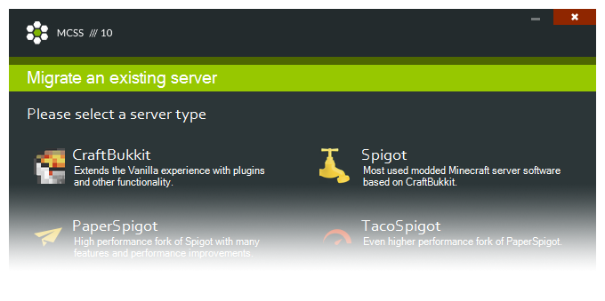

# Migrate an existing server

---

## Choosing a server type

There are a few supported types to choose from. Pick the one that matches your server you wish to import.

## Details and importing the old server

It's time to fill in all details about your server.

Setting name | Description
--- | ---
Server Name | A name for your server, this is only visible to you.
Folder Path | A unique location for your server, stored in the /servers directory.
Startup Line | The command used to start the server. It is tempting to change the ***[RAM]*** variable but I can only discourage you from doing so. Instead use the appropriate ***Server Ram*** setting.
Server Ram | The amount of memory that will be dedicated to your server.

Next click on the green folder icon in the bottom corner and browse to the location of the server you want to migrate. Select the server jar.

Before you click "Migrate" make sure that the other server is offline.

## Wrapping it up

All done! Wasn't that easy?

