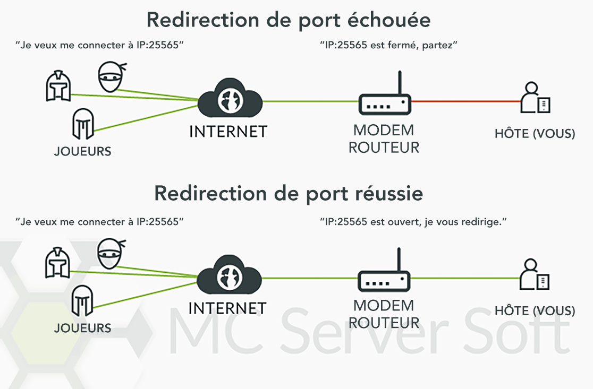
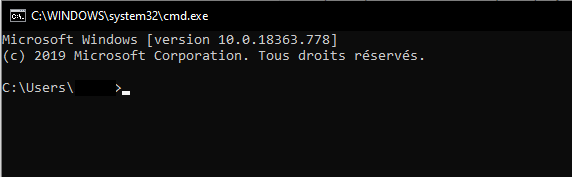
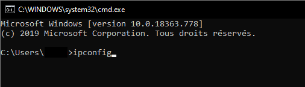
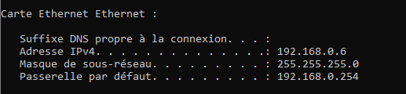
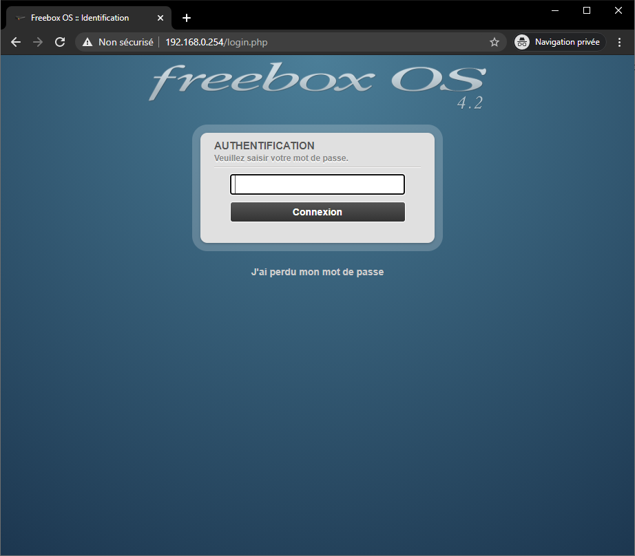

# Port forwarding

---

## Introduction

I could have just written an A to Z tutorial but at the end of the day you would still have no idea what you actually did. Troubleshooting problems and maintaining your network would be tricky and painfull. So in this guide I'll be focusing on port forwarding and the basic logic arround it.

Port forwarding or port mapping isn't that difficult, it might look complicated at first but it really isn't. The pupose of port forwarding is to make a specific programs on your computer accessible to other computers on the internet. It is commonly used for hosting game servers, peer-to-peer transfers, voice-over-ip applications and much more.

It isn't something you need to configure on your computer but in your modem's and/or router's web interface. In most household networks the modem contains a router with wireless capability and everything is hooked up to that. So in that case you would only need to change the settings in the modem itself.

In my case, I have a modem with the wireless features turned off and I've hooked up a more powerful router to the modem. So I will need to portforward the modem and the external router.

As you can see it becomes a bit confusing, if you don't know how your network is setup.

## Different network devices

In any network you might find one of these devices:

Device | Description
--- | ---
Modem | This is usually provided by your internet service provider, ISP for short. Simply put: it provides a way to recieve and send data needed for your telephone, TV and internet connection.
Router | A device that creates a network between the computers in your home by wire or wifi. Many internet provider install modems with an built-in router. (with or without wireless capabilities)
Switch | Looks the same as a router but it does less. You would use a switch to expand your network, *ex. 1 cable goes in, 3 cables go elsewhere.*
Hub | Honestly, throw this thing away. Hubs are very old, they are the switches of the past. All they do is receive signals and forward them to all connected devices. They add unneeded latency and noise on the network. Just want to point out that it would be a good time to upgrade to a switch.

So go ahead and look arround to see how your network is setup.

## Setting-up the port forwarding rule

Now that you have a good sense on which router/modem you are running behind. It's finally time to connect to the machine that you want to configure.

Every manufacturer has its own interface, so they all look different. Unfortunately it would be impossible for us to make a detailed tutorial on how to set up a redirect for everyone, but here is a general guide on how to port forward for a Minecraft server.

### Step 1 : make sure that you have a compatible router

To have access to port forwarding, your internet connection must be wired (xDSL or fiber). This means that if you have a 4G/cellular router, it will be impossible for you to open a port of your network.

If you have a wired internet, it is very likely that your router will support port forwarding, but it might be possible that your ISP has blocked this feature.

### Step 2: Find the ip of the modem/device (default gateway)

Open up a command line prompt, you can do this by pressing `Windows Key + R` and type `cmd` and hit <kbd>Enter</kbd>. Or you can search for `Command Prompt` under your apps.

Type <var>ipconfig</var> and hit <kbd>Enter</kbd>.

This is my result, it will look different but the layout is more or less the same. What we need it the IP address of the ***Default Gateway***.

## Step 3 : access the router interface

Open a browser and type the address you got from the command prompte into the address bar.

At this point, you will need to know the admin password of you router. 
If it was never changed, it might be the name/serial number of your router. Try the different numbers you can find written on your router, often on the back. If none works, you can search for the default passwords that exists by googling the model number of your router.

## Step 4: setting up the port forward

Fisrt, check [this website](https://portforward.com/router.htm), they have over hundreds of tutorials for almost every brand and model. If yours isn't listed and you can't find any similar model, here are the general steps to follow :
  *	turn on the advanced settings mode if there is one
  *	find the settings and open the local network category
  *	find the "port mapping" or "port management" page
  *	create a new forwarding rule
  *	enter the local ip of your PC (it can be found with the method as Step 2, just look for `IPv4 address` instead of default gateway)
  *	choos the TCP protocol, and set both the public/remote and private/local port to 25565 (or another port if you changed it in your server's settings)
  *	apply all the changes

Once you have set the forwarding rule, you can check if it works. Make sure your Minecraft server is running and go to [https://canyouseeme.org/](https://canyouseeme.org/). ENter you public ip address and the port of your server, click the <kbd>check port</kbd> button. If your rule was properly setup, it should indicate that the port is open.

You can now share your public ip to your friends and ask them to connect to your server with it.

I hope this guide has been somewhat useful to you, good luck!
