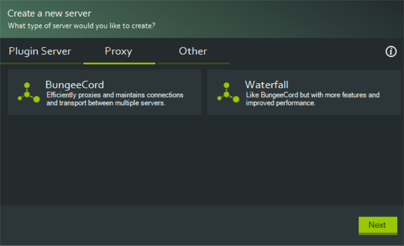
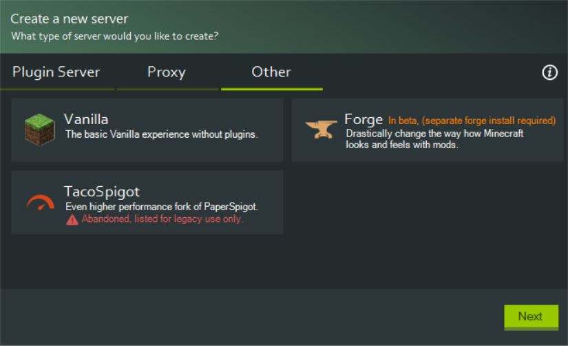

# Server Types

There are many server types available. Here is a quick rundown of all of them:

| Name | Description | Extra Info | Project Homepage | Project Download | Easy Download |
|------|-------------|------------|------------------|------------------|---------------|
| CraftBukkit | Allows plugins to be uploaded. | Deprecated, not recommended | https://bukkit.org | https://bukkit.gamepedia.com/FAQ#Where_can_I_get_it.3F | https://getbukkit.org/download/craftbukkit |
| Spigot | Allows plugins to be uploaded. Fork of Bukkit. | Still actively developed. | https://spigotmc.org | https://hub.spigotmc.org/jenkins/job/BuildTools/ | https://getbukkit.org/download/spigot |
| Paper | Allows plugins to be uploaded. Fork of Spigot with extra performance and features. | Recommended, still actively developed. | https://papermc.io | https://papermc.io/downloads | |

| Name | Description | Extra Info | Project Homepage | Project Download | Easy Download |
|------|-------------|------------|------------------|------------------|---------------|
| BungeeCord | Allows only proxy plugins to be uploaded. | Actively developed by the authors of Spigot. | https://www.spigotmc.org/wiki/about-bungeecord/ | https://ci.md-5.net/job/BungeeCord/ | https://ci.md-5.net/job/BungeeCord/lastStableBuild/artifact/bootstrap/target/BungeeCord.jar |
| Waterfall | Allows only proxy plugins to be uploaded. Fork of BungeeCord with extra performance and features. | Recommended, actively developed by the authors of Paper. | https://github.com/PaperMC/Waterfall/blob/master/README.md#waterfall | https://papermc.io/downloads#Waterfall | |

| Name | Description | Extra Info | Project Homepage | Project Download | Easy Download |
|------|-------------|------------|------------------|------------------|---------------|
| Vanilla | The same as a standard singleplayer world, but allowing others to play with you. | No mods/plugins. | https://minecraft.net | https://www.minecraft.net/en-us/download/server | https://getbukkit.org/download/vanilla |
| Forge | Allows mods to be uploaded. | | https://minecraftforge.net | https://files.minecraftforge.net | |
| TacoSpigot | Allows plugins to be uploaded. Fork of Paper with extra performance and features. | Abandoned, not recommended. | https://tacospigot.github.io | **(JENKINS CI DOWN)** https://github.com/TacoSpigot/TacoSpigot/releases/tag/v1.9.4-R0.1 | |

* ### Mods
    * #### Downloading Mods
        You can download mods from sites such as [CurseForge](https://www.curseforge.com/) or [Minecraft Mods](https://www.minecraftmods.com/).
    * #### Installing Mods
        To install the previously downloaded mod/s, you need to navigate to your server files, these can be found in the `Servers` folder in the instalation directory of mcss, you should see all the available servers, navigate to the one you want to add your mod/s to *(The server needs to be Forge to be able to support mod/s)* there should be a folder called `mods` *(If this folder does not exist run the server and look again, if it still hasnt generated you can ask for help in help support)* you simply drag and drop your downloaded mod/s into that folder, restart or start your server and your done!
* ### Plugins
    * #### Plugin Compatability
        |  | Bukkit (server) | Spigot (server) | Paper (server) | Sponge (server) |
        |---|---|---|---|---|
        | Bukkit (plugin) | ✅ | ✅ | ✅ | ❌ |
        | Spigot (plugin) | ❌ | ✅ | ✅ | ❌ |
        | Paper (plugin) | ❌ | ❌ | ✅ | ❌ |
        | Sponge (plugin) | ❌ | ❌ | ❌ | ✅ |
    * #### Downloading Plugins
        You can download plugins from sites such as [Spigot](https://www.spigotmc.org/resources/) or [Bukkit](https://dev.bukkit.org/bukkit-plugins).
    * #### Installing Plugins
        To install the previously downloaded plugin/s, you need to navigate to your server files, these can be found in the `Servers` folder in the instalation directory of mcss, you should see all the available servers, navigate to the one you want to add your plugin/s to *(The server needs to be Bukkit, Spigot or Paper to be able to support the relative plugin/s)* there should be a folder called `plugins` *(If this folder does not exist run the server and look again, if it still hasnt generated you can ask for help in help support)* you simply drag and drop your downloaded plugin/s into that folder, restart or start your server and your done!
* ### Datapacks
    * #### Downloading Datapacks
        You can download datapacks from sites such as [Planet Minecraft](https://www.planetminecraft.com/data-packs/).
    * #### Installing Datapacks
        Download the data pack. It should be a .zip file or directory. To use datapacks, your server must be running Minecraft 1.13 or newer. To update aserver, see [this page](./update-server.md).
        Navigate to your server folder. It can be found in the `Servers` folder in the instalation directory of mcss, you should see all the available servers, navigate to the one you want to add your datapack/s to. You can also get to this folder directly from MCSS, by clicking `Server > Show in file explorer`. Open your world/map folder, most often called `world`, and put your datapacks in the `datapacks` folder. Restart your server and if the datapack is in the correct format and version it should be enabled. You can verify by typing `/datapack list enabled` from the console or as a level 3 operator and find an entry named `[file/your data pack file/directory name]`.
